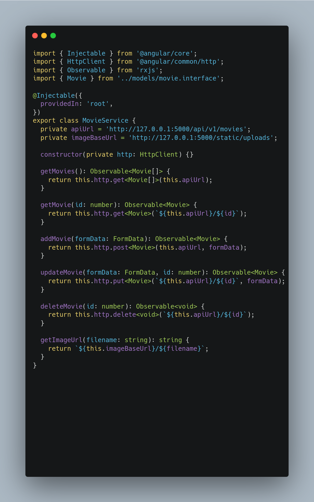

# MoviesAppFrontend

This project was generated with [Angular CLI](https://github.com/angular/angular-cli) version 14.2.13.

## Requisitos

- Node version 14.15.0 o la siguiente de Node.js version estable LTS.
- Instalar el cli version 14 `npm install -g @angular/cli@14`.

## Configuración del Entorno

1. Clona este repositorio:

   ```bash
   git clone https://github.com/VicatS/movies-frontend-angular.git
   cd movies-frontend-angular

2. Descargar las librerias necesarias

   ```bash
   npm install

3. Correr el proyecto

   ```bash
   ng serve

4. Abrir tu navegador y colocar la siguiente url

   ```bash
   http://localhost:4200/

## Configuracion adicionales



- Verificar la url del  backend `http://127.0.0.1:5000/`
